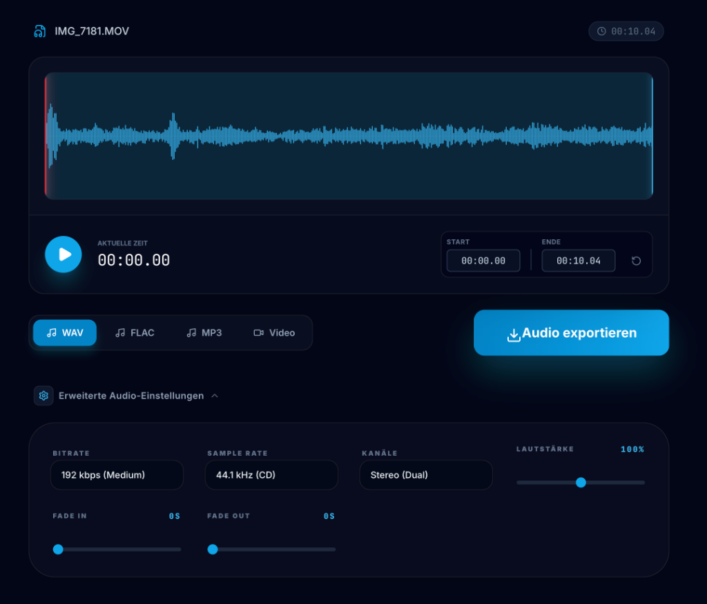

# Audio Video Extractor 2026



🇩🇪 **Deutsch** | 🇬🇧 [English](#english)

Ein webbasiertes Tool, gebaut mit Next.js, um Audiodateien aus Videos zu extrahieren oder Audiotracks anzupassen und umzuwandeln. Es nutzt `fluent-ffmpeg` und `ffmpeg-static` für die vollständige serverseitige Verarbeitung.

## Wofür kann man diese Software nutzen?
Mit dem Audio Video Extractor 2026 kannst du:
- **Audio aus Videos extrahieren**: Lade eine Videodatei hoch und erhalte nur die Tonspur (z.B. als MP3, WAV oder FLAC).
- **Audio zuschneiden**: Wähle einen bestimmten Startpunkt und eine Dauer (in Sekunden) aus, um nur einen kleinen Ausschnitt herauszuschneiden.
- **Formate konvertieren**: Wandle bestehende Audio- oder Videodateien in verschiedene Audioformate (MP3, WAV, FLAC) um.
- **Audio-Eigenschaften anpassen**: Passe Bitrate, Abtastrate (Sample Rate) und Kanäle (Channels) direkt beim Exportieren an.
- **Lautstärke und Effekte**: Ändere die Lautstärke oder füge einen bequemen "Fade-In" oder "Fade-Out" (Ein- und Ausblenden) hinzu.

## Voraussetzungen
- Node.js (ab Version 20.x empfohlen)

## Installation und lokaler Start
1. Abhängigkeiten installieren:
   ```bash
   npm install
   ```
2. Entwicklungsserver starten:
   ```bash
   npm run dev
   ```
3. Öffne `http://localhost:3000` in deinem Browser.

---

<h2 id="english">🇬🇧 English</h2>

A web-based tool built with Next.js to extract audio files from videos or customize and convert audio tracks. It relies on `fluent-ffmpeg` and `ffmpeg-static` for full server-side processing.

## What can you do with this software?
With the Audio Video Extractor 2026 you can:
- **Extract Audio from Videos**: Upload a video file and get only the audio track (e.g., as MP3, WAV or FLAC).
- **Trim Audio**: Select a specific start point and a duration (in seconds) to cut out only a small segment.
- **Convert Formats**: Convert existing audio or video files into various audio formats (MP3, WAV, FLAC).
- **Adjust Audio Properties**: Customize the bitrate, sample rate, and channels right before exporting.
- **Volume and Effects**: Change the volume or easily add a "Fade In" or "Fade Out" effect.

## Prerequisites
- Node.js (version 20.x or higher recommended)

## Installation and Local Startup
1. Install dependencies:
   ```bash
   npm install
   ```
2. Start the development server:
   ```bash
   npm run dev
   ```
3. Open `http://localhost:3000` in your browser.
