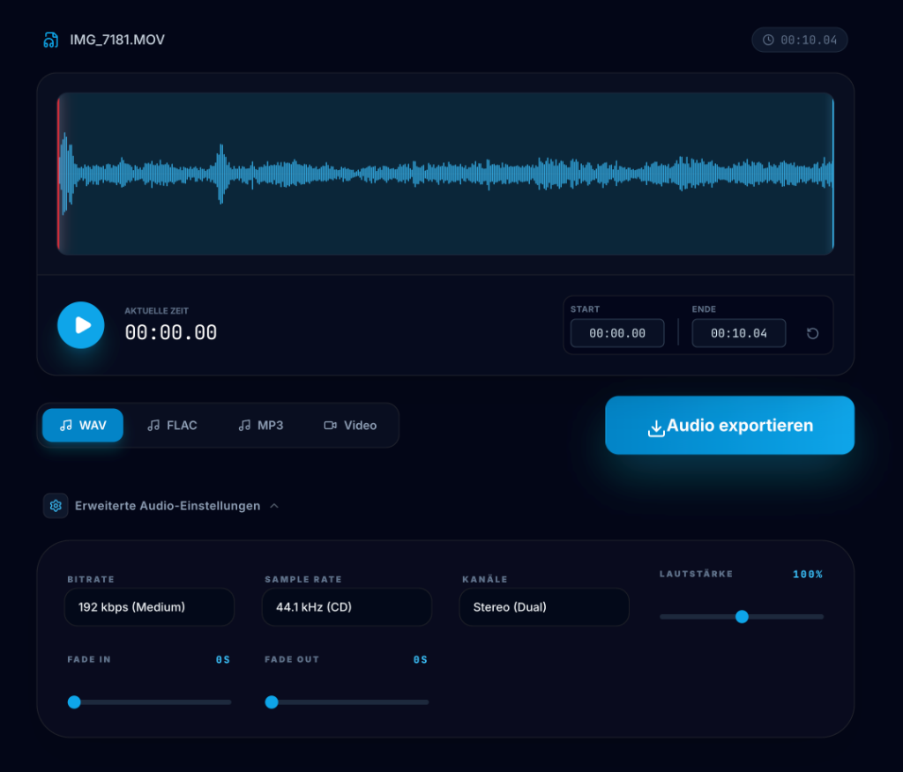

# Audio Video Extractor 2026



🇩🇪 **Deutsch** | 🇬🇧 [English](#english)

Ein webbasiertes Tool, gebaut mit Next.js, um Audiodateien aus Videos zu extrahieren oder Audio-/Videotracks anzupassen und umzuwandeln. Der Export nach WAV läuft direkt im Browser (Web Audio API + Web Worker), MP3/FLAC/MP4-Export läuft über clientseitiges `ffmpeg.wasm`; für den serverseitigen Export-Endpunkt kommen `fluent-ffmpeg` und `ffmpeg-static` zum Einsatz. Die Anmeldung erfolgt über Clerk.

## Wofür kann man diese Software nutzen?
Mit dem Audio Video Extractor 2026 kannst du:
- **Audio aus Videos extrahieren**: Lade eine Videodatei hoch und erhalte nur die Tonspur (als MP3, WAV oder FLAC).
- **Audio zuschneiden**: Wähle Start- und Endpunkt per Wellenform-Editor (Maus, Touch oder Tastatur mit den Pfeiltasten) oder über manuelle Zeiteingaben.
- **Video exportieren**: Schneide ein Video zu und exportiere es als MP4 mit anpassbarer Framerate, Auflösung und Qualität (CRF).
- **Formate konvertieren**: Wandle bestehende Audio- oder Videodateien in verschiedene Audioformate (MP3, WAV, FLAC) um.
- **Audio-Eigenschaften anpassen**: Passe Bitrate, Abtastrate (Sample Rate) und Kanäle (Channels) direkt beim Exportieren an.
- **Lautstärke und Effekte**: Ändere die Lautstärke oder füge einen "Fade-In"/"Fade-Out" hinzu.
- **Tastaturkürzel**: Leertaste zum Abspielen/Pausieren, Pfeiltasten zum Verschieben der Auswahl-Handles.

## Voraussetzungen
- Node.js (ab Version 20.x empfohlen)
- Ein Clerk-Konto/Projekt (Umgebungsvariablen siehe `.env.example`)

## Installation und lokaler Start
1. Abhängigkeiten installieren:
   ```bash
   npm install
   ```
2. `.env.local` auf Basis von `.env.example` mit deinen Clerk-Keys anlegen.
3. Entwicklungsserver starten:
   ```bash
   npm run dev
   ```
4. Öffne `http://localhost:3000` in deinem Browser.

> **Hinweis (macOS Apple Silicon):** Falls `npm run build`/`npm run dev` mit `Failed to load SWC binary for darwin/arm64` fehlschlägt, fehlt das optionale native Paket. Abhilfe: `npm install @next/swc-darwin-arm64`.

---

<h2 id="english">🇬🇧 English</h2>

A web-based tool built with Next.js to extract audio from videos or customize and convert audio/video tracks. WAV export runs fully client-side (Web Audio API + Web Worker), MP3/FLAC/MP4 export runs via client-side `ffmpeg.wasm`, and the server-side export endpoint uses `fluent-ffmpeg` with `ffmpeg-static`. Authentication is handled by Clerk.

## What can you do with this software?
With the Audio Video Extractor 2026 you can:
- **Extract Audio from Videos**: Upload a video file and get only the audio track (as MP3, WAV or FLAC).
- **Trim Audio**: Select a start and end point via the waveform editor (mouse, touch, or keyboard arrow keys) or manual time inputs.
- **Export Video**: Trim a video and export it as MP4 with adjustable frame rate, resolution, and quality (CRF).
- **Convert Formats**: Convert existing audio or video files into various audio formats (MP3, WAV, FLAC).
- **Adjust Audio Properties**: Customize the bitrate, sample rate, and channels right before exporting.
- **Volume and Effects**: Change the volume or easily add a "Fade In" or "Fade Out" effect.
- **Keyboard shortcuts**: Spacebar to play/pause, arrow keys to nudge the selection handles.

## Prerequisites
- Node.js (version 20.x or higher recommended)
- A Clerk account/project (see `.env.example` for the required environment variables)

## Installation and Local Startup
1. Install dependencies:
   ```bash
   npm install
   ```
2. Create `.env.local` based on `.env.example` with your Clerk keys.
3. Start the development server:
   ```bash
   npm run dev
   ```
4. Open `http://localhost:3000` in your browser.

> **Note (macOS Apple Silicon):** If `npm run build`/`npm run dev` fails with `Failed to load SWC binary for darwin/arm64`, the optional native package is missing. Fix: `npm install @next/swc-darwin-arm64`.
